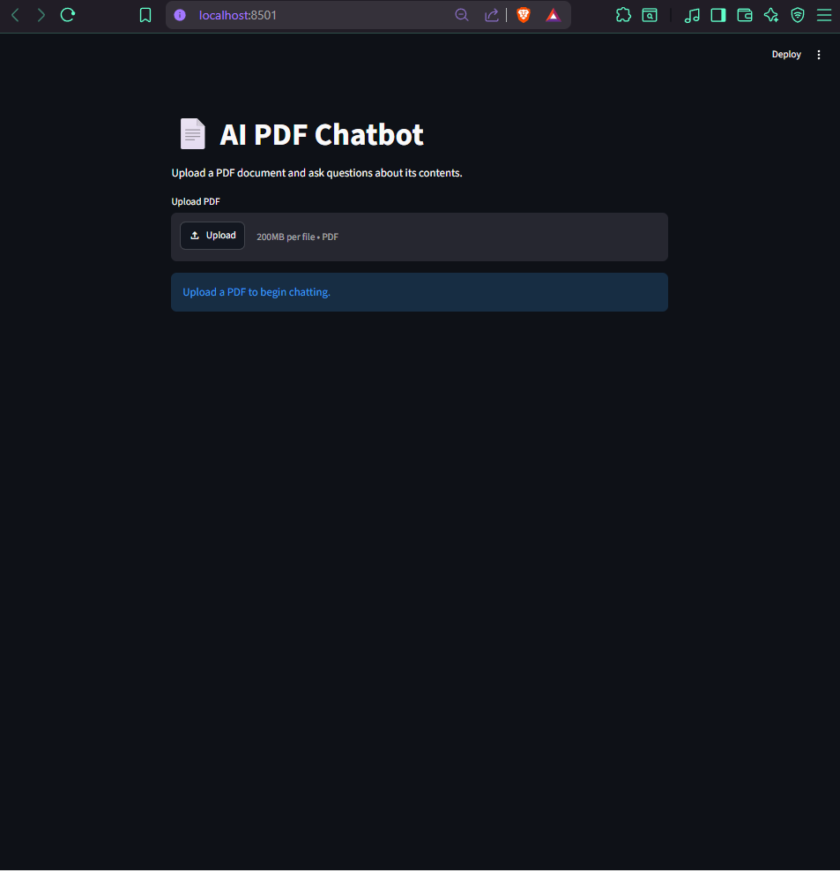
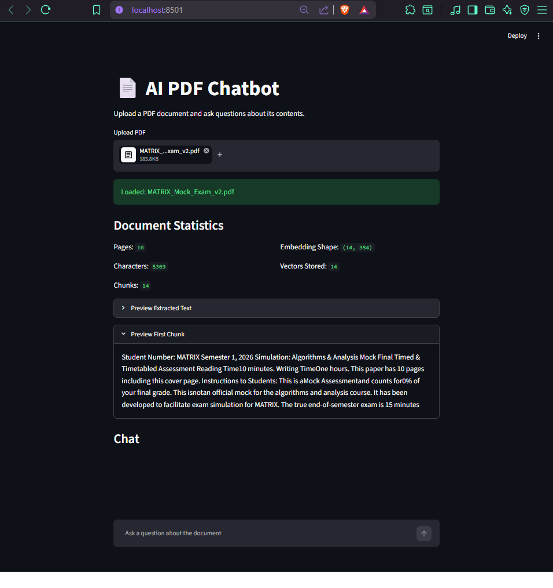
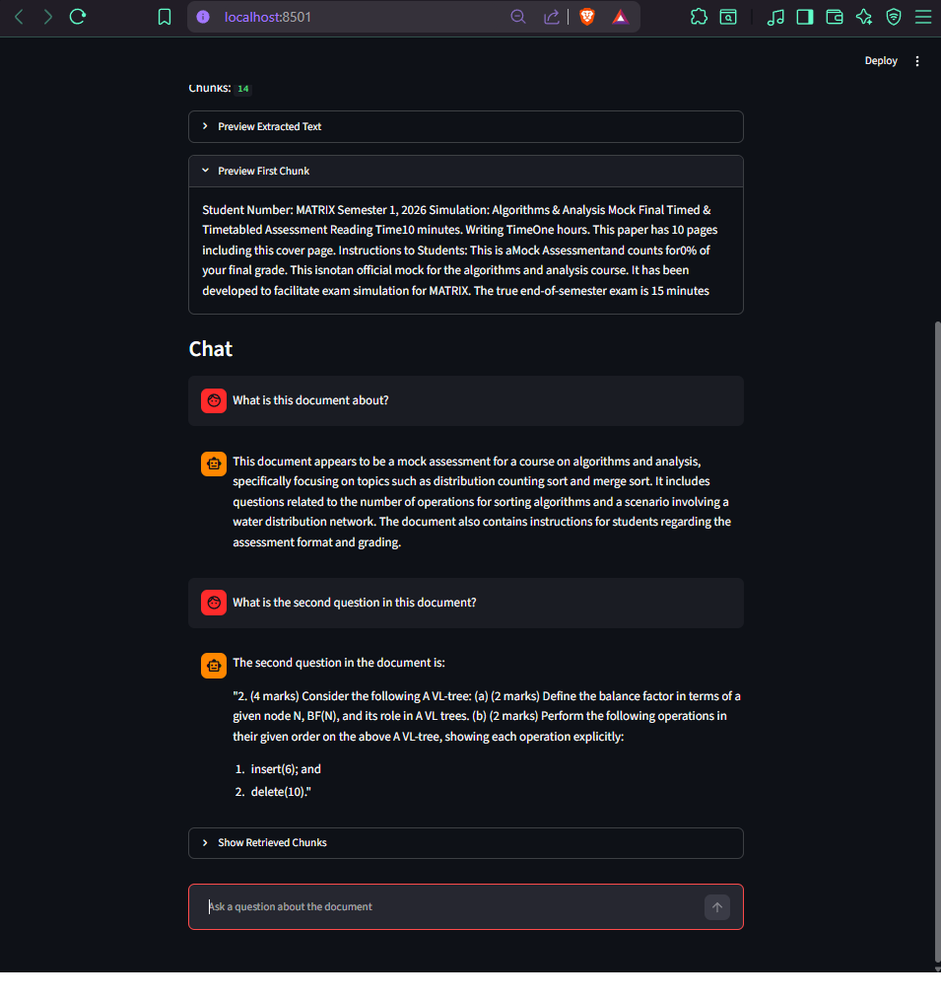

# AI PDF Chatbot with RAG

An AI powered PDF chatbot that allows users to upload PDF documents and ask natural language questions about their contents.

The application uses a Retrieval Augmented Generation (RAG) pipeline that combines document retrieval, semantic search, vector embeddings, and Large Language Models (LLMs) to provide context aware answers directly from uploaded documents.

---

## Features

* Upload PDF documents
* Extract and process document text
* Automatic text chunking
* Semantic embeddings using Sentence Transformers
* Vector similarity search with FAISS
* Retrieval Augmented Generation (RAG)
* OpenAI powered question answering
* Multi turn conversational chat interface
* Document statistics and chunk previews
* Source retrieval transparency

---

## Technology Stack

### Frontend

* Streamlit

### NLP & AI

* OpenAI GPT 4o Mini
* Sentence Transformers
* LangChain Text Splitters

### Vector Search

* FAISS (Facebook AI Similarity Search)

### Document Processing

* PyPDF

### Programming Language

* Python

---

## System Architecture

```text
PDF Upload
     ↓
Text Extraction (PyPDF)
     ↓
Text Chunking
     ↓
Sentence Embeddings
     ↓
FAISS Vector Database
     ↓
Semantic Similarity Search
     ↓
Relevant Document Chunks
     ↓
OpenAI GPT 4o Mini
     ↓
Generated Answer
```

---

## Application Preview

### PDF Upload

Upload any PDF document and automatically process its contents.

### Document Analysis

The application displays:

* Number of pages
* Character count
* Number of chunks
* Embedding dimensions
* Stored vector count

### Conversational Question Answering

Users can ask natural language questions such as:

```text
What is this document about?

What is the second question in the document?

What algorithms are discussed?
```

The chatbot retrieves relevant sections of the document and generates context aware responses.

---

## Project Structure

```text
rag-pdf-chatbot/
│
├── app/
│   └── streamlit_app.py
│
├── data/
│
├── vectorstore/
│
├── README.md
├── requirements.txt
└── .gitignore
```

---
## Home Screen



## Document Processing



## AI Question Answering



## Installation

### Clone Repository

```bash
git clone https://github.com/SashaneJay/rag-pdf-chatbot.git
cd rag-pdf-chatbot
```

### Create Virtual Environment

```bash
python -m venv venv
```

### Activate Virtual Environment

Windows:

```bash
venv\Scripts\activate
```

Mac/Linux:

```bash
source venv/bin/activate
```

### Install Dependencies

```bash
pip install -r requirements.txt
```

---

## Environment Variables

Create a `.env` file in the project root:

```env
OPENAI_API_KEY=your_openai_api_key
```

---

## ▶Run Application

```bash
streamlit run app/streamlit_app.py
```

The application will be available at:

```text
http://localhost:8501
```

---

## Example Workflow

1. Upload a PDF document.
2. The document is automatically parsed and chunked.
3. Text embeddings are generated using Sentence Transformers.
4. Chunks are stored in a FAISS vector index.
5. User submits a question.
6. Relevant chunks are retrieved using semantic similarity search.
7. GPT generates an answer based only on retrieved context.
8. The answer is displayed in the chat interface.

---

## Skills Demonstrated

This project demonstrates practical experience with:

* Retrieval Augmented Generation (RAG)
* Large Language Models (LLMs)
* OpenAI API Integration
* Semantic Search
* Vector Databases
* Document Processing
* Natural Language Processing (NLP)
* Prompt Engineering
* Python Development
* Streamlit Application Development

---

## Future Improvements

* Persistent vector database storage
* Multiple PDF support
* Conversation memory
* Citation highlighting
* Source page references
* Hybrid search (keyword + semantic)
* Local LLM support (Ollama/Llama)
* Document summarization
* PDF comparison capabilities

---

## Disclaimer

This project is intended for educational and demonstration purposes only. Responses generated by the AI model should be verified against the original document before being used in critical applications.

---

## Author

**Sashane Jayawardene**

GitHub: https://github.com/SashaneJay

LinkedIn: [www.linkedin.com/in/sashane-jayawardene-72a0](http://www.linkedin.com/in/sashane-jayawardene-72a0)
